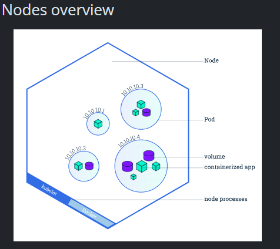
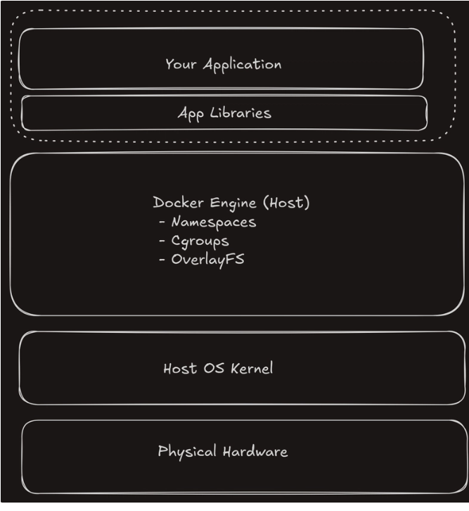

# Lessons learned

This is a note of the challenges, edge-cases and errors I encountered while building this project

* Azure B-series v1 capacity is unreliable across European regions
* B-series v2 is the current generation to target
* Quota increases are sometimes needed even when SKUs show as available
* prevent_deletion_if_contains_resources = false is essential for clean destroys
* Orphaned resources break subsequent destroys — the resource group force-delete saves you
* Azure resource group propagation delay can cause 404 errors on child resources immediately after creation. Running terraform apply a second time resolves it since the resource group is already fully propagated by then. Solution is to include a depends_on field inside each module block declared in the root main.tf like this:

```tf
module "network" {
  source = "./modules/network"

  resource_group_name = azurerm_resource_group.main.name
  project_name        = var.project_name
  location            = var.location

  depends_on = [azurerm_resource_group.main] // depends_on field
}
```

Kubernetes rule of 3

## Namespaces, Pods and nodes

* **Namespace**: A namespace is a virtual cluster that multiple groups of users can share.
Namspace is a feature that lets you isolate your resources logically

Any resource that exists within Kubernetes exists either in the **default namespace** or a namespace that is created by the cluster operator

Only nodes and persistent storage volumes exist outside of the namespace; these low-level resources are always visible to every namespace in the cluster.

What is the “default” namespace in Kubernetes?
Kubernetes comes with three namespaces out-of-the-box. They are:

* default: As its name implies, this is the namespace that is referenced by default for every Kubernetes command, and where every Kubernetes resource is located by default. Until new namespaces are created, the entire cluster resides in ‘default’.

* kube-system: Used for Kubernetes components and should be avoided.

* kube-public: Used for public resources. Not recommended for use by users.


* **NOde** A Pod always runs on a Node. A Node is a worker machine in Kubernetes and may be either a virtual or a physical machine, depending on the cluster. Each Node is managed by the control plane. A Node can have multiple pods, and the Kubernetes control plane automatically handles scheduling the pods across the Nodes in the cluster. The control plane's automatic scheduling takes into account the available resources on each Node



###

Why use Kubernetes namespaces?
There are many use cases for Kubernetes namespaces, including:

* Allowing teams or projects to exist in their own virtual clusters without fear of impacting each other’s work.

* Enhancing role-based access controls (RBAC) by limiting users and processes to certain namespaces.

* Enabling the dividing of a cluster’s resources between multiple teams and users via resource quotas.

* Providing an easy method of separating development, testing, and deployment of containerized applications enabling the entire lifecycle to take place on the same cluster.

* Pods: A group of one or more app containers (such as Docker), and some shared resources for those containers. Those shared resources include: shared storage as volumes, networking as a unique cluster of IP address etc

* Container: A running app/process + everything it needs (libraries, configs, tools) all  bundled into a lightweight package that runs on any machine with Docker installed.

It is not a VM (it shares the hosts OS kernel), but keeps its processes isolated




### How can pods communicate across Kubernetes namespaces?

Although namespaces are separate from each other, they can easily communicate with each other. Kubernetes DNS service directory can easily locate any service by its name by using the expanded form of DNS addressing:

..svc.cluster.local

Simply adding the namespace name to the service name provides access to services in any namespace on the cluster. For example, to access the payroll service in the development namespace you would use the address

payroll.development

To access the payroll service in the production namespace you would use:

payroll.production

Note that network policies can optionally be utilized to control access between namespaces. For example, a network policy can allow or deny all traffic from other namespaces. Network polices apply only to connections and are not a substitute for firewalls that perform packet inspection.

* Explain manifest v. playbook

## Buildtime vs Runtime variables in docker

* **Question**: In taskapp_backend we didnt specify env variables in the dockerfile, so how will the backend image launch without a db then when the image is run?

The backend's env vars (DATABASE_HOST, DATABASE_PASSWORD etc.) are runtime variables — they're not needed to build the image, only when the container actually starts and tries to connect to Postgres.
The frontend's VITE_API_URL is a build time variable — Vite needs it during npm run build to bake the URL into the JS bundle. After that the value is frozen in the compiled files.
So for the backend:

The image builds fine with no DB — it's just copying code and installing packages, nothing connects to Postgres at build time
When Kubernetes starts the container, it injects the env vars from the backend-config ConfigMap and backend-secret Secret we already created
Only then does the app boot, read os.getenv('DATABASE_HOST') etc., and connect to Postgres

That's exactly why we set up the **ConfigMap** and **Secret** in the manifests (when setting up kubernetes) — they're the runtime environment for the backend container. The Dockerfile doesn't need to know about them at all.

## Pods and objects

wait a minute, is every yaml file a declaration of a pod?

21:45
No — and this is a really important distinction to nail down.

Every YAML file is a declaration of a Kubernetes object. A pod is just one type of object. Look at what you've created so far:

namespace.yaml → Namespace object — no pod
backend-config.yaml → ConfigMap object — no pod
backend-secret.yaml → Secret object — no pod
postgres-service.yaml → Service object — no pod
postgres-statefulset.yaml → StatefulSet object — this one manages pods
taskapp-migrate.yaml → Job object — this one manages pods
The pattern is: some objects manage pods (StatefulSet, Deployment, Job, DaemonSet), and some objects have nothing to do with pods at all (Namespace, ConfigMap, Secret, Service). The ones that manage pods all have a template: block inside them — that's the pod definition embedded inside the higher-level object.

You never directly create pods in production manifests. You create the object that manages pods, and Kubernetes creates/destroys the actual pods on your behalf based on that spec.

## Stateless vs Stateful

Good instinct to want the generic definition rather than just the Kubernetes-specific one.
Stateful means the system remembers things between interactions. The history of what happened to it matters to how it behaves now. A database is the classic example — what's in it right now is a direct result of every write that ever happened to it. If you restart it without preserving that history (the data), it's broken. Other examples: a user's session, a shopping cart, a message queue.
Stateless means every interaction is self-contained. The system doesn't remember anything from before. Give it the same input, get the same output, regardless of what happened before. A REST API endpoint is the classic example — a GET /tasks request carries everything the server needs to respond (auth token, query params), and the server doesn't need to remember anything about your previous requests. Other examples: a load balancer, a CDN, a pure function in code.
The practical consequence: stateless things scale horizontally with zero coordination — spin up 10 identical copies, any one of them can handle any request. Stateful things require careful handling — you can't just spin up 10 copies of a database and expect them to automatically agree on what the data is. That coordination (replication, consensus, leader election) is exactly what makes stateful systems hard.
You'll see this distinction everywhere: stateless vs stateful protocols (HTTP vs WebSockets), stateless vs stateful firewalls, stateless vs stateful components in React, stateless vs stateful functions in cloud computing. Same core idea every time.

## Why VXLANS and pod traffic wrapping is required when working with k8s on multiple machines

but whats even the point of wrapping pod traffic, why does k8s need that, we dont wrpa traffic for nginx and backend services in anything and they are azure is able to receive their traffic and give to them without trouble, even normal docker containers which may have different private ips in them

07:21
Really good question — and the confusion makes sense. Let me draw the distinction clearly.

When you run Nginx on a VM directly (or even a plain Docker container), the traffic flow is:

Internet → Azure NIC (10.0.1.4) → Nginx process
Azure knows 10.0.1.4 — it's the VM's actual IP, registered in Azure's network fabric. Azure can route to it no problem.

When Kubernetes creates a pod, the pod gets an IP like 192.168.170.200. That IP exists only inside the Linux kernel's network stack on that specific node. Azure has absolutely no idea it exists — it's not registered anywhere in Azure's routing tables. It's like a private IP inside a private IP.

So when a pod on node A wants to talk to a pod on node B:

Pod (192.168.170.206) → wants to reach → Pod (192.168.3.8)
Azure's routers see 192.168.3.8 as the destination and say "never heard of it" — and drop the packet. Because to Azure, only 10.0.1.x addresses exist.

The wrapper solves this by disguising the packet:

Inner: 192.168.170.206 → 192.168.3.8   (what Kubernetes wants)
Outer: 10.0.1.4 → 10.0.1.6             (what Azure actually sees)
Azure happily forwards 10.0.1.4 → 10.0.1.6 because those are real VM IPs it knows about. The destination node unwraps it and delivers it to the right pod.

Why doesn't Docker on a single VM need this? Because all containers on one VM share that VM's network stack — the kernel already knows all their IPs locally, no routing across Azure's network needed. The moment you span multiple machines, you need something to bridge the gap between "IPs Azure knows" and "IPs Kubernetes invented."

That's the entire job of a CNI like Calico — bridging that gap. The wrapping is just the mechanism.

## Why 2+ replicas for pods

Remember earlier when we talked about stateless vs stateful? The backend is stateless — any replica can handle any request, they're all identical. So instead of running one pod that becomes a single point of failure, you run 2+ replicas of the same pod simultaneously.
The benefits:
High availability — if one pod crashes or its node goes down, the other replica is still serving traffic. Zero downtime. This is what the brief means by "HA" (highly available).
Load distribution — incoming requests get spread across both replicas by the Service, so no single pod is overwhelmed.
Zero-downtime deploys — when you push a new image, Kubernetes replaces replicas one at a time (RollingUpdate). With 2 replicas and maxUnavailable: 0, one replica stays up serving traffic while the other gets replaced, then they swap. The app never goes offline.
Why 2 minimum specifically? Because 1 replica gives you none of those benefits — if that one pod is being replaced during a rolling update, you have zero replicas serving traffic momentarily. 2 is the minimum for true zero-downtime.
This is also why the brief says "spread across different nodes" using topologySpreadConstraints — running both replicas on the same node defeats the purpose. If that node goes down, both replicas die together.
Same logic applies to the frontend — 2+ replicas, spread across nodes.

## The k8s rule of 3

The "odd number" rule (3, 5, 7) applies specifically to systems that need consensus/quorum — like etcd, ZooKeeper, Kafka brokers, or Kubernetes control plane nodes themselves. The reason is purely mathematical: with 3 nodes, you can lose 1 and still have a majority (2/3). With 4 nodes, you can still only lose 1 before losing quorum (you need 3/4), so 4 buys you nothing over 3. Odd numbers maximize fault tolerance per node added.
For regular application pods (like your backend/frontend) — the odd number rule doesn't apply at all. Those pods don't vote on anything or need consensus. They just serve requests independently. So:

2 replicas → can lose 1, still serving traffic ✅
3 replicas → can lose 1, still serving traffic + more capacity ✅
4 replicas → fine too, no quorum math needed